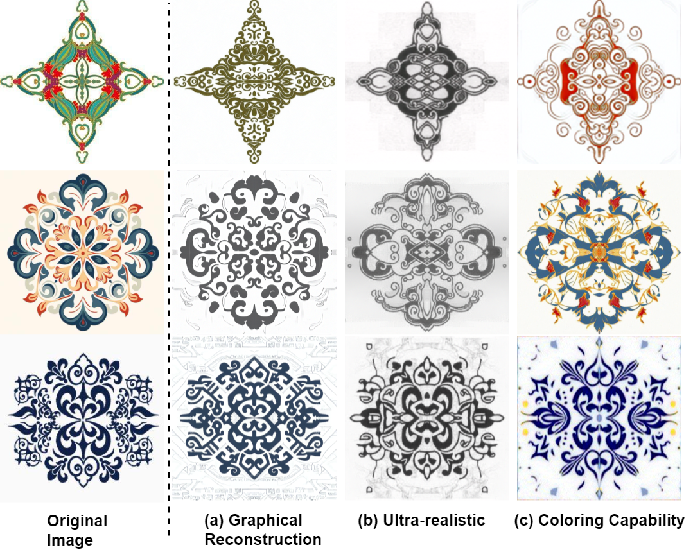

ALD-Net：Adaptive Local Diffusion Network for Ethnic Pattern Synthesis

In this paper, we propose a method of adaptive local diffusion model, which can improve the effect of image generation compared with the most advanced methods. This is the official implementation repository of ALD-Net.

Results presentation

The code is coming soon.